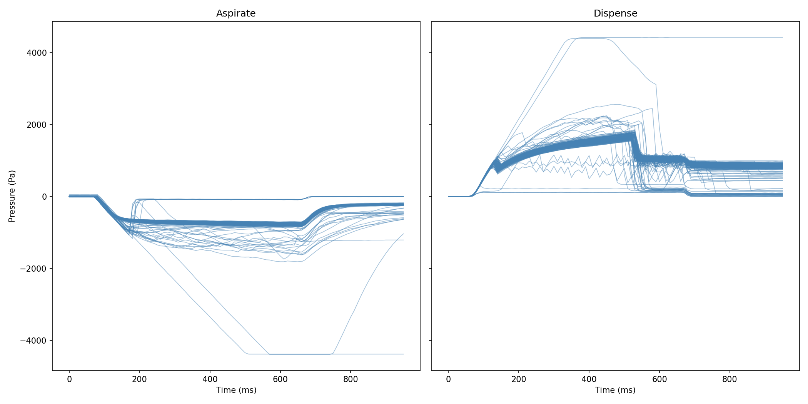
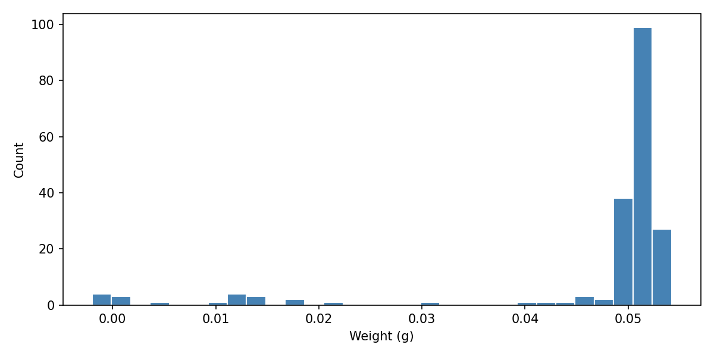

# tadm-classifier

Tools for loading, exploring, and visualising Hamilton TADM pressure curves alongside gravimetric weights.

The long-term goal is to train a classifier (e.g. with scikit-learn) that predicts pipetting quality from the pressure waveform shape. That work is planned for a future milestone - the current codebase covers data loading, alignment, and exploratory visualisation.

## Setup

```bash
python -m venv .venv
.venv\Scripts\activate
pip install -r requirements.txt
```

> **Requirements:** Python ≥ 3.9, a 32-bit or 64-bit [Microsoft Access Database Engine](https://www.microsoft.com/en-us/download/details.aspx?id=54920) matching your Python bitness (needed by `pyodbc` to open `.mdb` files).

## Data layout

Place run files in `data/`. Each run consists of two paired files:

| File | Pattern | Contents |
|---|---|---|
| MDB | `{prefix}_{RunID}_ML_STAR_tadm.mdb` | Raw TADM pressure curves (Access database) |
| TXT | `{RunID}.txt` | Gravimetric weights - one float per pipetting event |

The **RunID** (32-character hex string) embedded in the MDB filename must match the TXT filename stem (e.g. `375a1ed352c249328a1829c17885849d.txt`). Multiple runs can coexist in `data/` and will all be loaded automatically.

## src/ module layout

| Module | Purpose |
|---|---|
| `src/db.py` | `mdb_connection` context manager and `read_table` helper - thin pyodbc abstraction for reading Access MDB files |
| `src/curves.py` | Read the `TadmCurve` table and decode each `CurvePoints` binary blob into a sequence of pressure values |
| `src/weights.py` | Parse the single-column gravimetric weight TXT files |
| `src/dataset.py` | Discover matched MDB / TXT file pairs and assemble the full merged DataFrame |

## Quick start

```bash
python explore.py
```

Prints a dataset summary to the console and writes three files to `output/`:

| Output file | Contents |
|---|---|
| `dataset.csv` | Full long-format dataset (one row per time-step per pipetting event) |
| `tadm_pressure_curves.png` | All TADM pressure waveforms, faceted by step type (Aspirate / Dispense) |
| `weight_distribution.png` | Histogram of gravimetric weights across all runs |

## Alignment assumption

Within each run, aspirate curves and dispense curves are each sorted chronologically by `CurveId` and then aligned **positionally** to the weight rows: the nth aspirate curve maps to the nth weight, and likewise for dispense. This matches the row-order convention used by the original instrument script. If an MDB and TXT file have different event counts, a warning is printed and only the overlapping samples are kept.

## Sample output

### Dataset (first 10 rows)

| RunID | CheckSum | StepType | StepLabel | ChannelNumber | SampleIndex | CurveTime | CurvePressure | Weight |
|---|---|---|---|---|---|---|---|---|
| 375a1ed352c249328a1829c17885849d | -231352388 | -533331728 | Aspirate | 1 | 0 | 0 | 4 | 0.04013 |
| 375a1ed352c249328a1829c17885849d | -231352388 | -533331728 | Aspirate | 1 | 0 | 10 | 0 | 0.04013 |
| 375a1ed352c249328a1829c17885849d | -231352388 | -533331728 | Aspirate | 1 | 0 | 20 | 4 | 0.04013 |
| 375a1ed352c249328a1829c17885849d | -231352388 | -533331728 | Aspirate | 1 | 0 | 30 | 4 | 0.04013 |
| 375a1ed352c249328a1829c17885849d | -231352388 | -533331728 | Aspirate | 1 | 0 | 40 | 4 | 0.04013 |
| 375a1ed352c249328a1829c17885849d | -231352388 | -533331728 | Aspirate | 1 | 0 | 50 | 0 | 0.04013 |
| 375a1ed352c249328a1829c17885849d | -231352388 | -533331728 | Aspirate | 1 | 0 | 60 | 4 | 0.04013 |
| 375a1ed352c249328a1829c17885849d | -231352388 | -533331728 | Aspirate | 1 | 0 | 70 | 0 | 0.04013 |
| 375a1ed352c249328a1829c17885849d | -231352388 | -533331728 | Aspirate | 1 | 0 | 80 | -92 | 0.04013 |
| 375a1ed352c249328a1829c17885849d | -231352388 | -533331728 | Aspirate | 1 | 0 | 90 | -209 | 0.04013 |

### Plots

#### TADM pressure curves by step type



#### Weight distribution histogram


